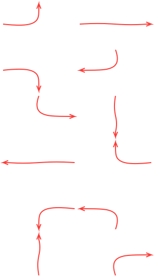

# ArrowView

Simple UIView that draws lines with arrowheads. Arrows can start and end on any edge of the view's frame at the edge's mid-point. Uses UIBezierPath to do the line drawing to get a nice wavy and flowing
effect.

There is an Arrows playground to play and experiment with.
